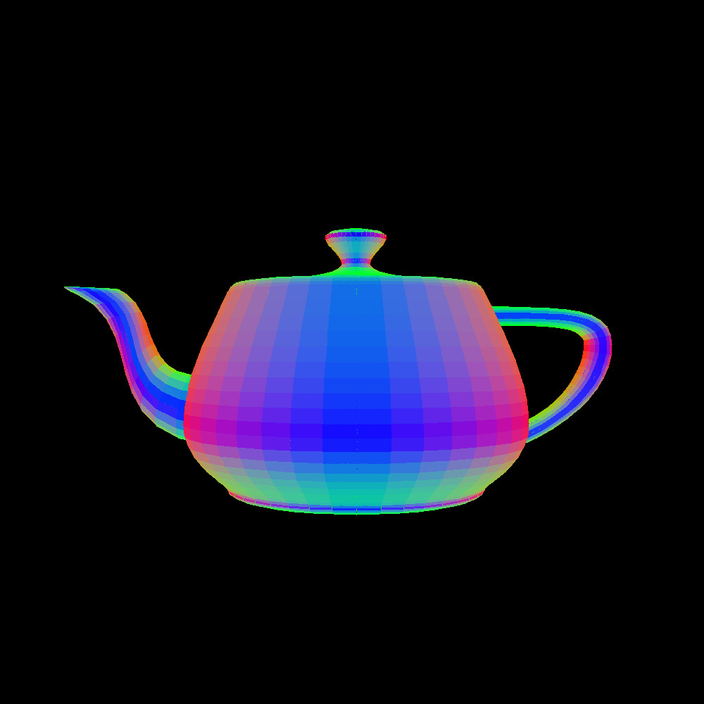

# J-Grangle

## Description
**J-Grangle** is a program which produces an image of the given object file in **jgraph** format.  
It is a mix of jgraph and rangle, which is in turn a mix of Rust and triangle.

## TA Testing
To re-generate the example outputs, run `make clean && make`.  
First, the program will compile and then outputs `01-*.jpg` through `11-*.jpg` will be generated.  
Because this program is doing graphics work on a CPU, it may take a moment to finish. For example, on a Hydra machine, the whole process took around 3 minutes.  
We thank you for your patience.

## Usage
The executable is located at `target/release/j-grangle`.  
However, you may also run it with `cargo run --release -- [OPTIONS]`.
```
J-Grangle 

USAGE:
    j-grangle [OPTIONS] <OBJ-FILE> <width> <height>

FLAGS:
    -h, --help       Prints help information
    -V, --version    Prints version information

OPTIONS:
    -b, --background <background_color>    The background color [default: 0 0 0]
    -m, --mode <mode>                      The display mode used to render the model [default: triangles]  [possible
                                           values: triangles, lines, points]
        --pitch <pitch>                    The value in radians to rotate the model around the x-axis [default: 0]
        --roll <roll>                      The value in radians to rotate the model around the z-axis [default: 0]
    -s, --scale <scale>                    The x y z values to scale the model by [default: 1 1 1]
        --shader <shader>                  The pre-compiled set of shaders to use [default: normal]  [possible values:
                                           normal, solid]
    -c, --color <shader_color>             The color of the object
    -t, --translate <translate>            The xyz values to translate the model by [default: 0 0 0]
        --yaw <yaw>                        The value in radians to rotate the model around the y-axis [default: 0]

ARGS:
    <OBJ-FILE>    Path to obj file
    <width>       The width in pixels
    <height>      The height in pixels
```

## Examples
`j-grangle obj/teapot.obj 1000 1000 | jgraph -P | convert - 02-teapot-hd.jpg`  
  

`j-grangle obj/teapot.obj 500 500 --mode lines --background "0.5 0.5 0.5" | jgraph -P | convert - 05-teapot-background.jpg`  
  

`j-grangle obj/bunny.obj 500 500 --scale "30 30 30" --translate "-1 2 0" | jgraph -P | convert - 10-bunny-translate.jpg`
  
